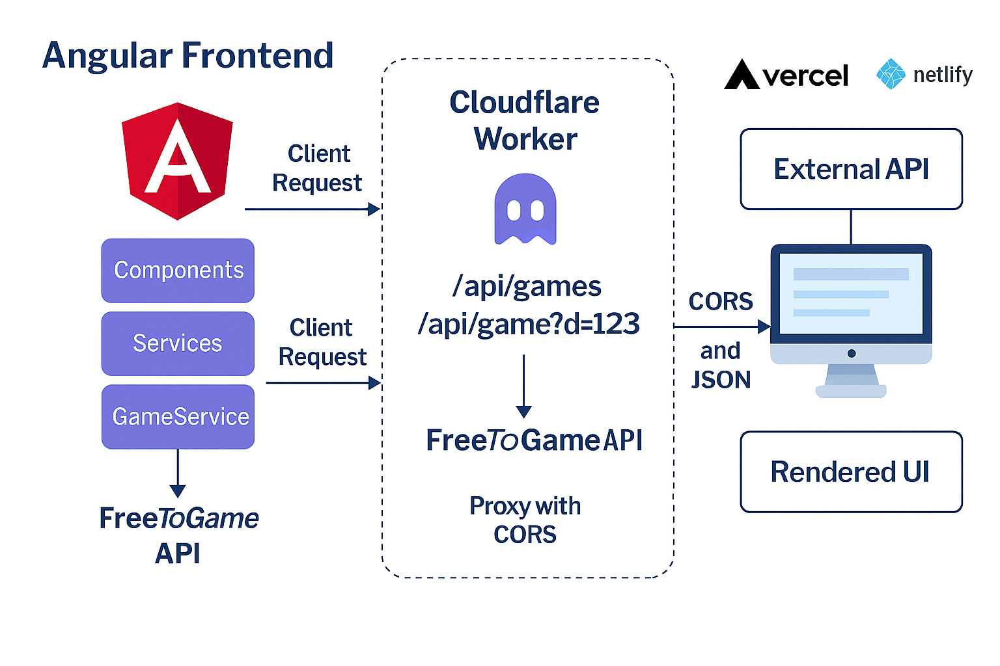

# 🎮 Free Game Finder

An Angular frontend application that displays free-to-play games using data from the [FreeToGame API](https://www.freetogame.com/).  
Requests are proxied through a **Cloudflare Worker** to bypass CORS restrictions, ensuring smooth integration with modern browsers.  
The app is deployable on **Vercel** or **Netlify**.

---

## ✨ Features

- Angular frontend with routing, services, and reusable components
- GameService fetches game list and details via a Worker proxy
- Cloudflare Worker handles:
  - `/api/games` → list of games
  - `/api/game?id=123` → details for a specific game
- Worker adds CORS headers to support browser requests
- Responsive UI with genre filtering, sorting, and search
- Easy deployment on Vercel or Netlify

---

## 🧩 Architecture Overview

```plaintext
Angular Frontend → Cloudflare Worker → FreeToGame API
       ↑                 ↓
   Client Request   Adds CORS headers
       ↓                 ↑
   Rendered UI     JSON Response
⚙️ Setup Instructions
1. Clone the repo
bash
git clone https://github.com/your-username/free-game-finder.git
cd free-game-finder
2. Install dependencies
bash
npm install
3. Run locally
bash
ng serve
4. Deploy Worker
Use Cloudflare Wrangler to deploy your proxy:

bash
wrangler deploy
🌐 Cloudflare Worker Proxy Code
javascript
export default {
  async fetch(request) {
    const url = new URL(request.url);

    const corsHeaders = {
      "Access-Control-Allow-Origin": "*",
      "Access-Control-Allow-Methods": "GET, OPTIONS",
      "Access-Control-Allow-Headers": "*",
      "Access-Control-Max-Age": "86400",
      "Content-Type": "application/json"
    };

    // Handle preflight OPTIONS request
    if (request.method === "OPTIONS") {
      return new Response(null, { status: 204, headers: corsHeaders });
    }

    let targetUrl = null;

    // /api/games
    if (url.pathname === "/api/games") {
      targetUrl = "https://www.freetogame.com/api/games";
    }

    // /api/game?id=123
    if (url.pathname === "/api/game") {
      const id = url.searchParams.get("id");
      targetUrl = `https://www.freetogame.com/api/game?id=${id}`;
    }

    if (targetUrl) {
      const response = await fetch(targetUrl);
      const data = await response.json();
      return new Response(JSON.stringify(data), {
        status: response.status,
        statusText: response.statusText,
        headers: corsHeaders
      });
    }

    return new Response("NOT FOUND", { status: 404, headers: corsHeaders });
  }
}
📁 Folder Structure
Code
src/
├── app/
│   ├── components/      # UI components
│   ├── services/        # GameService and other services
│   └── routing/         # Angular routing modules
├── assets/              # Static assets
├── environments/        # Environment configs
└── index.html           # Entry point
🚀 Live Demo
Vercel: your-vercel-url.vercel.app

Netlify: your-netlify-url.netlify.app

📄 License
MIT © Your Name

Code

---

This is ready to paste into your repo. Do you want me to also add **badges** (Angular version, Cloudflare Worker, Vercel/Netlify deploy, MIT license) at the top so it looks more professional?

